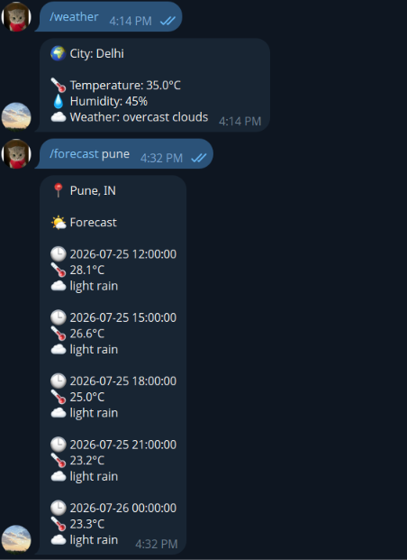
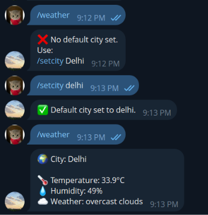

# Telegram Weather & Time Bot
[](LICENSE)

A Go-based Telegram bot providing weather forecasts, time information, geocoding, and location-based services.

## Demo




## Features

- Weather forecasts
- Time and timezone information
- Location and geocoding
- Telegram Bot API integration
- PostgreSQL support
- External API integration
- Docker support

## Tech Stack

- Go
- Telegram Bot API
- PostgreSQL
- Docker
- REST APIs

## Project Structure

```text
telegram_bot/
├── Forecast/
├── database/
├── geocoding/
├── handlers/
├── timeapi/
├── weather/
├── main.go
├── go.mod
├── go.sum
├── Dockerfile
└── docker-compose.yml
